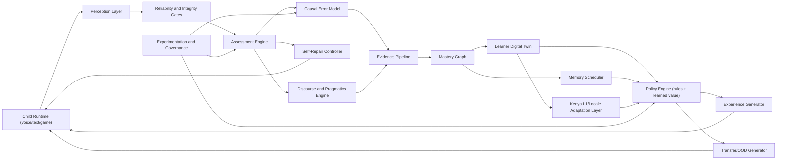
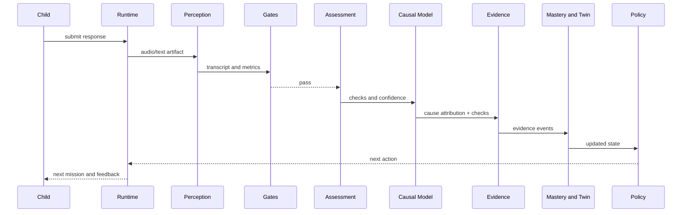
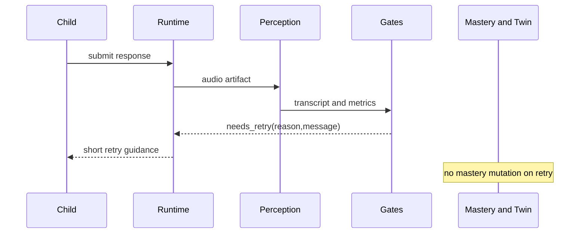
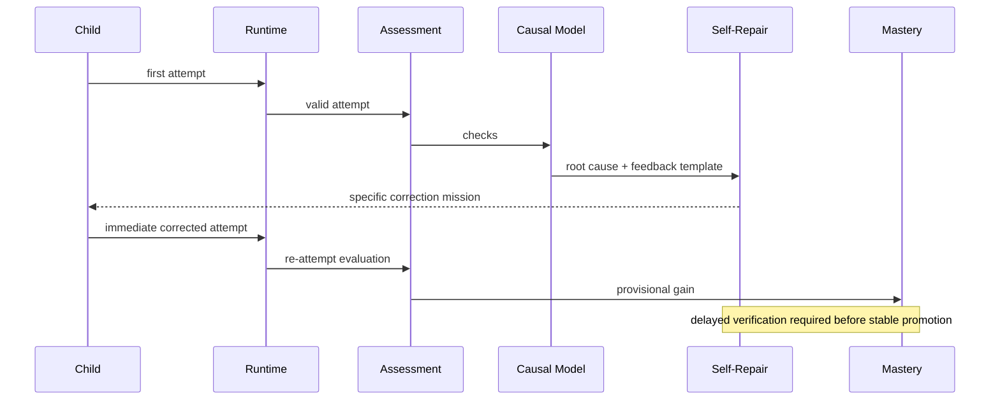
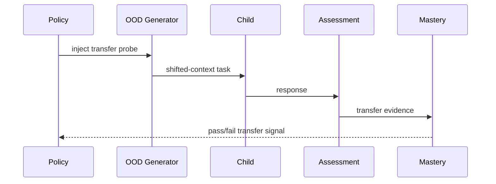

# Autonomous English Autopilot Blueprint

Last updated: 2026-02-17

## 1. Product Thesis

This product is not a lesson catalog. It is an autonomous learning control system that moves each child from current English state to a target state with measurable guarantees.

Core claim:
1. If AI can reliably perceive learner output.
2. If AI can infer not only score, but error cause.
3. If AI can choose and improve next actions from outcomes.
4. If AI can verify transfer and retention under distribution shift.
5. Then AI can autonomously deliver language outcomes at scale.

Primary optimization target:
1. Long-horizon mastery and transfer.
2. Not short-term engagement metrics.

## 2. Target Outcome (Operational Definition of "Perfect")

"Perfect English knowledge" is defined by explicit performance guarantees, not by vague fluency language.

Target profile:
1. CEFR-equivalent C2 performance in speaking, listening, reading, and writing.
2. Stable transfer across unseen contexts, topics, interlocutors, and communication goals.
3. Retention after 7, 30, and 90 day delays without major collapse.
4. Robust repair behavior: the child can self-correct, paraphrase, and recover from misunderstandings.
5. Pragmatic competence: register control, argument quality, discourse cohesion, and context-appropriate tone.

Exit criteria:
1. Domain mastery thresholds reached with low uncertainty.
2. Transfer verification passed on out-of-distribution (OOD) tasks.
3. Retention checks passed at delayed intervals.
4. No critical dependency gaps in the mastery graph.

## 2.1 CEFR Coverage Map (Formal Requirement)

Purpose:
1. Guarantee that CEFR claims are backed by explicit descriptor coverage.

Coverage contract:
1. Every CEFR can-do descriptor used in product scope maps to:
   - at least one mastery node,
   - at least one task template family,
   - at least one rubric row in assessment.
2. Each mastery node stores CEFR level tags and prerequisite links.
3. Promotion to milestone levels requires descriptor-family coverage minimums, not only aggregate score.
4. Coverage gaps are treated as release blockers for target-level claims.

Operational artifact:
1. Maintain a versioned `descriptor -> node -> task -> rubric` matrix with testable completeness checks.

## 2.2 Goal Hierarchy (Global and Local)

Hard decision:
1. C2 is the fixed global North Star for every learner.
2. Local goals are required operational milestones on the path to C2.

Hierarchy contract:
1. Policy optimizes time-to-next-local-goal under a hard constraint of non-regression from the C2 path.
2. Local goals can differ by age band, program horizon, and current state, but cannot redefine final destination.
3. Milestone completion requires `mastery + transfer + retention` gates for that stage.
4. Product reporting always shows both `distance-to-next-local-goal` and `distance-to-C2`.

## 3. Product Principles

1. Outcome over content volume.
2. Closed loop by default: every attempt changes state or is explicitly marked non-informative.
3. Causality over surface scoring: always ask "why the error happened".
4. Kenya-first localization: adapt to local language background and classroom context.
5. Transfer by design: OOD checks are always-on, not occasional audits.
6. Policy must learn from history, not freeze in hand-written heuristics.
7. Mandatory self-repair loop: attempt -> feedback -> correction -> delayed verification.
8. Pedagogical diversity must be constrained and measurable.
9. Child-facing feedback must be short, supportive, and actionable.
10. Uncertainty-aware promotion: no high-stakes advancement on weak evidence.
11. Generator and evaluator remain decoupled to reduce self-confirmation bias.
12. Every important decision must be explainable in machine-readable form.
13. Learning velocity is a first-class objective; reliability controls must be budgeted, not open-ended.

## 4. End-to-End System Architecture



Architecture intent:
1. Split sensing, judging, causal diagnosis, state updates, and planning.
2. Make each module replaceable without rewriting the full pipeline.
3. Keep learner-state mutations traceable to explicit evidence.

## 5. Module Specifications

## 5.1 Child Runtime Layer

Purpose:
1. Deliver low-friction child experience for daily practice.
2. Capture multimodal learner outputs with voice-first UX.

Inputs:
1. Task payload from Experience Generator.
2. Tone and pacing policy from Motivation Engine.

Outputs:
1. Raw interaction events.
2. Audio/text artifacts.
3. Behavioral signals (latency, retries, abandonment, help usage).

Core components:
1. Session shell and mission framing.
2. Task renderer.
3. Recorder and upload flow.
4. Retry and repair UI.
5. Lightweight reward feedback.

Failure handling:
1. Silent/unclear/off-topic response -> immediate retry flow.
2. Repeated retries -> scaffolded simpler task variant.
3. Persistent block -> recommended human check-in.

## 5.2 Perception Layer

Purpose:
1. Transform raw artifacts into normalized machine-observable signals.

Submodules:
1. Audio preprocessing.
2. Speech-to-text and token timing.
3. Prosody and pronunciation metrics.
4. Speech rate and pause extraction.
5. Speaker consistency estimation.
6. Language identification and code-switch tagging.

Inputs:
1. Audio buffer.
2. Task metadata and expected mode.

Outputs:
1. Transcript.
2. Speech metrics.
3. Confidence bundle.
4. Speaker integrity score.
5. Language/code-switch tags with confidence (English/Swahili/Sheng/home-language hints).

Quality requirements:
1. Bounded latency.
2. Calibrated confidence.
3. Deterministic fallback when external model is unavailable.

## 5.3 Reliability and Integrity Gates

Purpose:
1. Stop low-quality or invalid attempts before state mutation.

Gate stack:
1. Capture validity (empty/too short).
2. Clarity (inaudible/whisper/unintelligible).
3. Relevance-at-start (response unrelated from opening segment).
4. Speaker integrity (likely not learner voice).

Output contract:
1. `completed`: proceed to full evaluation.
2. `needs_retry`: terminal retry state with child-facing guidance.
3. `failed`: technical failure.

Rule for topic drift:
1. If opening segment is on-task, allow continuation even if later drift exists.
2. Later drift is scored as partial completion, not invalid capture.

## 5.4 Assessment Engine

Purpose:
1. Produce structured quality judgments for valid attempts.

Judge families:
1. Task completion.
2. Grammar and syntax.
3. Vocabulary and usage.
4. Pronunciation and speech quality.
5. Coherence and discourse.
6. Pragmatics for advanced stages.

Design:
1. Hybrid deterministic checks plus LLM judges.
2. Confidence and calibration attached per check.
3. Strict separation between scoring and policy recommendation.

Input:
1. Transcript.
2. Speech metrics.
3. Task constraints and target nodes.

Output:
1. Structured checks and confidence.
2. Child-facing feedback candidates.
3. Calibration metadata.

## 5.5 Causal Error Model

Purpose:
1. Infer root cause, not only error presence.

Cause taxonomy (minimum):
1. Rule confusion.
2. L1 interference.
3. Retrieval failure.
4. Instruction misread.
5. Attention loss.
6. Production constraint (time/load).
7. Mixed-cause ambiguity.
8. Unknown/insufficient evidence.

Inputs:
1. Assessment checks.
2. Task context.
3. Learner history and recent retries.

Outputs:
1. Cause label distribution including `mixed` and `unknown` mass.
2. Top-k causes with uncertainty interval.
3. Counterfactual hints (what likely would fix it).
4. Confidence score for each cause.

Usage:
1. Policy consumes causal distribution for next-action choice.
2. Evidence pipeline stores cause attribution for learning analytics.

Causal disambiguation protocol:
1. If posterior is ambiguous (`entropy > H_max` or `top1-top2 margin < M_min`), trigger disambiguation only when action choice is materially unstable.
2. Material instability means top candidate actions differ by expected value above `delta_action_value`.
3. Disambiguation probes are targeted micro-tasks designed to separate top competing causes.
4. Disambiguation runs under a strict budget (max probes per skill/session) to avoid over-diagnosis.
5. If ambiguity remains after budget, output must keep non-trivial `unknown/mixed` mass and policy must choose conservative but progress-preserving actions.

## 5.6 Kenya L1 and Locale Adaptation Layer

Purpose:
1. Operationalize local linguistic and classroom context for faster learning.

Scope for Kenya:
1. English + Swahili bilingual transfer patterns.
2. Sheng code-switch behavior.
3. Home language influence when available (for example Kikuyu, Luo, Kalenjin, Luhya, Kamba).
4. Local curriculum and exam-style expectations.

Core capabilities:
1. Interference priors by skill and age band.
2. Targeted micro-remediation templates per interference class.
3. Register adaptation between classroom and conversational contexts.

Design guardrails:
1. Never hardcode learner by nationality alone.
2. Adaptation must be evidence-driven per learner profile.
3. Adaptation logic must consume explicit language-id and code-switch signals from Perception.

## 5.7 Evidence Pipeline

Purpose:
1. Convert checks and causal signals into canonical evidence events.

Evidence dimensions:
1. Domain (grammar/vocab/pronunciation/discourse/pragmatics).
2. Kind (direct/supporting/negative).
3. Opportunity type (explicit/incidental).
4. Reliability class.
5. Cause attribution.

Output:
1. Immutable event rows linked to attempt and node identifiers.

Invariants:
1. No major promotion from weak incidental evidence.
2. High-stakes transitions require direct verified evidence.

## 5.8 Mastery Graph

Purpose:
1. Maintain probabilistic micro-skill mastery with uncertainty.

Node state:
1. Mastery mean.
2. Uncertainty.
3. Evidence counts.
4. Activation state (`observed`, `candidate_for_verification`, `verified`).
5. Decay/retention state.
6. Dominant error-cause history.

Edge state:
1. Prerequisites.
2. Transfer relations.
3. Domain bundles.

Update logic:
1. Reliability-weighted posterior updates.
2. Time-decay and retrieval gain.
3. Cause-weighted remediation pressure.

Graph quality governance:
1. Run graph-consistency tests on every graph version (`acyclic prerequisites`, `no orphan critical nodes`, `edge type validity`).
2. Track edge drift via observed transfer outcomes and trigger edge-confidence downgrade when empirical evidence diverges.
3. Block high-stakes promotion if graph version fails consistency checks.

## 5.8.1 Difficulty Calibration Layer

Purpose:
1. Provide a common calibrated difficulty scale across task families and modalities.

Mechanisms:
1. Maintain anchor-item sets spanning task families (speaking, listening, reading, writing).
2. Calibrate task difficulty to a shared latent scale with periodic recalibration windows.
3. Use anchor continuity checks when adding new task families or major generator changes.

Invariants:
1. Cross-family progress comparisons require shared-scale confidence above threshold.
2. OOD difficulty matching must use shared calibrated difficulty, not family-local heuristics only.

## 5.9 Learner Digital Twin

Purpose:
1. Unified decision state for policy control.

State vector:
1. Mastery graph projection.
2. Uncertainty hotspots.
3. Placement stage and confidence.
4. Motivation and friction signals.
5. Retry history.
6. L1/locale interference profile.
7. Discourse/pragmatics stage.

Update cadence:
1. Per attempt.
2. Per session summary.
3. Daily retention update.

## 5.9.1 Cold-Start Placement Orchestrator

Purpose:
1. Initialize learner state quickly with bounded uncertainty before normal policy control.

Algorithm contract:
1. Start from age-band and curriculum priors with explicit uncertainty.
2. Run short adaptive probe sequence across core domains (listening, speaking, grammar, vocabulary, reading, writing).
3. Use information gain objective to pick next probe until stop criteria is met.
4. Compute initial mastery distribution and uncertainty hotspots.
5. Hand off to normal policy with placement confidence and recommended first-week strategy.

Stop criteria:
1. Minimum evidence per core domain collected.
2. Uncertainty below configured threshold for progression-critical nodes.
3. Max placement budget reached (time/task count), then continue with guarded policy.

Outputs:
1. Placement stage.
2. Confidence report by domain.
3. Initial remediation priorities.

## 5.10 Policy Engine (Hybrid and Learning)

Purpose:
1. Choose next best action under uncertainty.

Action space:
1. Diagnostic probe.
2. Targeted practice.
3. Self-repair task.
4. Retrieval task.
5. Verification task.
6. Transfer/OOD task.
7. Recovery task.
8. Stretch challenge.

Architecture:
1. Hard pedagogical constraints.
2. Rule-based safety and curriculum guardrails.
3. Learned value model for expected long-term gain.
4. Off-policy evaluation and replay before policy promotion.

Decision logging contract (mandatory for learning policy):
1. Every decision log must include `policyVersion`, `contextSnapshotId`, and timestamp.
2. Must log full `candidateActionSet` considered at decision time.
3. Must log `preActionScores` for each candidate before final selection.
4. Must log selected action, `propensity` (or log-probability), and active constraint mask.
5. Must log outcome-link fields (`attemptId`/`taskId`/`sessionId`) for delayed reward attribution.
6. Missing fields invalidate the decision for off-policy value learning.
7. Logging pipeline must be async and non-blocking for task delivery; learner latency cannot depend on log write completion.

Objective function:
1. Maximize expected mastery gain over horizon.
2. Minimize frustration and churn risk.
3. Enforce verification and spacing obligations.
4. Penalize action myopia and repetitive patterns.

Fast-lane progression protocol:
1. If learner shows high-confidence streak with stable transfer signals, reduce diagnostic/OOD density to configured floor.
2. Reallocate saved budget to harder productive tasks and broader skill expansion.
3. Keep milestone safety gates unchanged while accelerating between-milestone progression.

Reward and credit assignment contract:
1. Optimize a composite reward with explicit terms: mastery delta, transfer success, retention success, and friction penalty.
2. Use delayed credit windows with fixed horizons (`same session`, `7-day`, `30-day`) for attribution.
3. Attribute value to actions using linked `decision -> attempt -> delayed outcome` traces; unlinked outcomes cannot train value model.
4. Keep reward versioned; policy promotion must compare against the same reward version.

Exploration strategy:
1. Use constrained exploration with a non-zero exploration floor and uncertainty-aware action selection.
2. Increase exploration when uncertainty or policy stagnation is high; reduce under stable high-confidence regimes.
3. Exploration is budgeted and cannot violate safety/curriculum hard constraints.

Outputs:
1. Chosen action.
2. Utility decomposition.
3. Human-readable rationale.
4. Machine-readable reason trace.

## 5.11 Experience Generator

Purpose:
1. Compile policy action into concrete child-facing task.

Responsibilities:
1. Task form selection.
2. Prompt generation.
3. Scaffolding depth.
4. Hint strategy.
5. Rubric alignment with assessment.

Pedagogical diversity controller:
1. Enforce semantic novelty in rolling windows.
2. Control lexical and syntactic complexity ramps.
3. Limit cognitive load spikes.
4. Preserve focus on the primary target skill.

Output contract:
1. Normalized task payload with explicit rubric fields.

## 5.12 Transfer and OOD Generator

Purpose:
1. Continuously test whether skill generalizes beyond practiced context.

OOD axes:
1. New topic.
2. New style/register.
3. New interlocutor pattern.
4. New communicative goal.
5. New prompt format.

Policy:
1. OOD tasks are injected regularly by policy budget, not on every task.
2. OOD failure routes into targeted remediation, not punishment.
3. Default OOD sampling budget is bounded (for example 10-20% attempts) and increases only near milestones or overfit signals.

Difficulty-matching protocol:
1. Each OOD probe carries an anchor difficulty from in-domain rubric and recent learner success band.
2. OOD probes default to one shifted axis at a time unless policy explicitly asks multi-axis stress test.
3. A transfer-fail label is valid only if matched-difficulty in-domain control is passed in the same window.
4. Policy stores difficulty deltas to separate "transfer failure" from "difficulty overload".

Milestone stress protocol (mandatory for milestone decisions):
1. Milestone promotion requires passing a multi-axis OOD stress set, not only single-axis probes.
2. Stress set must include at least two pairwise axis combinations (for example topic+register, interlocutor+goal).
3. Pass criteria use worst-case floor across stress probes, not average-only aggregation.
4. If single-axis passes but multi-axis fails, learner remains below milestone and enters transfer remediation path.
5. Multi-axis stress is reserved for milestone gates and must not be used as default daily workload.

Outputs:
1. OOD task spec with tagged shift dimensions.
2. Transfer evidence markers for mastery confidence.

## 5.13 Self-Repair Controller

Purpose:
1. Make correction behavior a mandatory learning primitive.

Loop contract:
1. Attempt.
2. Causal feedback.
3. Immediate corrected re-attempt.
4. Delayed verification task.

Rules:
1. No "accepted" improvement without delayed recheck.
2. Repeated same-cause errors trigger modality switch or stronger scaffolding.
3. Repair success updates both mastery and metacognitive resilience score.
4. Delayed verification must use a different task family or materially different prompt formulation from immediate repair.
5. Delayed verification on near-duplicate items is invalid for stable promotion.
6. Delayed verification should be scheduled to piggyback on normal task flow whenever possible, not create standalone overhead by default.

Budget guardrails:
1. Maximum 2 immediate repair loops per target skill in one session.
2. Maximum 25% of session time may be spent in immediate repair loops.
3. If budget is exhausted, enqueue delayed repair and continue with next optimal action.
4. Repeated unresolved loops trigger escalation recommendation instead of endless retries.

## 5.14 Memory Scheduler

Purpose:
1. Ensure retention by optimized retrieval timing.

Mechanisms:
1. Node-level review queues.
2. Interval adaptation from success and decay.
3. Portfolio mixing (fresh + review + transfer).
4. Priority boosts for fragile nodes.

Guarantees:
1. Critical nodes reviewed before predicted forgetting.
2. Verified nodes still receive delayed checks.

## 5.15 Motivation and UX Adaptation Engine

Purpose:
1. Keep effort sustainable while preserving instructional rigor.

Signals:
1. Retry streak.
2. Response latency.
3. Drop-off risk.
4. Session completion trend.

Actions:
1. Tone and pacing adaptation.
2. Task length adjustment.
3. Format rotation.
4. Recovery-mode activation.

Hard rule:
1. Engagement optimization cannot bypass learning constraints.

## 5.16 Discourse and Pragmatics Engine

Purpose:
1. Build high-level communication competence needed for C1/C2.

Core dimensions:
1. Argument structure and evidence use.
2. Register shift (formal/informal/classroom/social).
3. Turn-taking and repair strategies.
4. Long-form coherence and topic management.
5. Audience-aware language choice.

Assessment artifacts:
1. Discourse rubric scores.
2. Pragmatic misfire tags.
3. Repair-quality indicators.

## 5.17 Parent and Teacher Copilot

Purpose:
1. Provide clear intervention visibility without overwhelming details.

Views:
1. Current stage and confidence.
2. Main blockers by causal category.
3. Transfer and retention health.
4. Predicted time to next milestone.

Outputs:
1. Short operational brief.
2. Escalation recommendations only when deadlock risk is high.
3. Decision trace for major policy actions.

## 5.18 Experimentation and Governance

Purpose:
1. Improve models safely with evidence.

Mechanisms:
1. Offline replay and counterfactual evaluation.
2. Guardrailed online experiments.
3. Versioned feature flags by module.
4. Rollback playbook and shadow-mode validation.

Required artifacts:
1. Model and prompt registry.
2. Causal diagnosis regression suite.
3. Policy lift dashboard versus rule-only baseline.

Policy promotion gate (formal):
1. Offline replay: expected mastery gain lift >= 3% versus production baseline.
2. Offline safety: no degradation > 1% on retention, transfer pass rate, or frustration proxy.
3. Off-policy evaluation: lower confidence bound for net lift must remain > 0.
4. Shadow mode: zero invariant violations on configured minimum traffic window.
5. Online rollout: progressive ramp with stop-loss triggers and automatic rollback.
6. Independent anchor-eval set must show non-negative lift before production promotion.

## 6. Data Model Blueprint

Core entities:
1. Learner.
2. Attempt.
3. Task.
4. AssessmentCheck.
5. CausalDiagnosis.
6. EvidenceEvent.
7. MasteryNodeState.
8. LearnerTwinSnapshot.
9. PolicyDecisionLog.
10. PolicyOutcome.
11. OODTaskSpec.
12. SelfRepairCycle.
13. ReviewQueueItem.
14. FeedbackMessage.
15. CEFRCoverageMap.
16. PlacementSession.
17. ProgramGoalPlan.
18. DifficultyAnchorSet.
19. RewardTrace.
20. AnchorEvalRun.

Event-first design:
1. Immutable append-only events for attempts and evidence.
2. Materialized projections for low-latency reads.

Minimal event schema:
```json
{
  "eventId": "evt_123",
  "learnerId": "learner_1",
  "attemptId": "att_9",
  "timestamp": "2026-02-17T10:00:00Z",
  "type": "evidence_written",
  "payload": {
    "nodeId": "gse:node:123",
    "domain": "grammar",
    "kind": "direct",
    "score": 0.81,
    "confidence": 0.87,
    "reliability": "high",
    "causal": {
      "topLabel": "rule_confusion",
      "topP": 0.62,
      "distribution": [
        { "label": "rule_confusion", "p": 0.62 },
        { "label": "retrieval_failure", "p": 0.21 },
        { "label": "mixed", "p": 0.10 },
        { "label": "unknown", "p": 0.07 }
      ],
      "modelVersion": "causal-v1"
    }
  }
}
```

Mandatory policy decision log schema:
```json
{
  "decisionId": "dec_456",
  "timestamp": "2026-02-17T10:01:00Z",
  "learnerId": "learner_1",
  "policyVersion": "policy-v3",
  "contextSnapshotId": "twin_789",
  "candidateActionSet": ["diagnostic_probe", "targeted_practice", "transfer_probe"],
  "preActionScores": {
    "diagnostic_probe": 0.42,
    "targeted_practice": 0.57,
    "transfer_probe": 0.33
  },
  "chosenAction": "targeted_practice",
  "propensity": 0.61,
  "activeConstraints": ["spacing_guard", "retry_budget_guard"],
  "linkage": {
    "taskId": "task_99",
    "sessionId": "sess_12"
  }
}
```

## 7. Control Flows

## 7.1 Normal Learning Attempt



## 7.2 Retry Path (Unclear or Off-topic)



## 7.3 Mandatory Self-Repair Cycle



## 7.4 Continuous OOD Transfer Check



## 8. On-topic Opening, Later Drift Policy

System rule:
1. If opening segment is aligned with task intent, attempt remains valid.
2. Later drift is scored as partial completion inside assessment.
3. Only clearly unrelated starts trigger relevance retry.

Reason:
1. Children naturally branch in speech.
2. Over-strict invalidation creates false negatives and harms confidence.

## 9. KPI Framework

Learning KPIs:
1. Mastery gain per hour.
2. Verified node growth rate.
3. Retention at 7/30/90 days.
4. OOD transfer pass rate by shift dimension.

Diagnosis KPIs:
1. Causal label agreement on adjudicated samples.
2. Cause-specific remediation success rate.
3. Reduction of repeated same-cause errors.

Policy KPIs:
1. Expected value lift versus rules-only baseline.
2. Policy regret proxy (missed gain).
3. Safe-action rate under uncertainty.

Velocity KPIs:
1. Net mastery gain per active learning minute.
2. Diagnostic overhead ratio (diagnostic + verification attempts / total attempts).
3. Median time from error detection to successful corrected transfer.

Experience KPIs:
1. Session completion.
2. Retry recovery success.
3. Self-repair completion and delayed verification pass rate.
4. Child frustration proxy trend.

System KPIs:
1. Latency budget adherence per attempt.
2. Gate precision/recall by reason code.
3. Calibration error of major judges.

## 10. Operational Playbooks

## 10.1 Repeated Retry Loop
1. Detect retry streak threshold.
2. Switch to high-scaffold recovery task.
3. Reduce prompt complexity.
4. If unresolved, trigger human escalation recommendation.

## 10.2 Cause Plateau (Same Root Cause Repeats)
1. Detect repeated cause over rolling window.
2. Change modality and explanation strategy.
3. Inject contrastive minimal pairs.
4. Schedule delayed verification before progression.

## 10.3 Weak Transfer Despite High In-Domain Scores
1. Detect high practice performance and low OOD pass rate.
2. Increase OOD density.
3. Penalize policy overfitting to narrow templates.
4. Hold major promotions until transfer stabilizes.

## 10.4 Fast Progress with Low Reliability
1. Detect rapid jumps with weak evidence quality.
2. Route to verification-heavy queue.
3. Freeze high-stakes promotions until direct checks pass.

## 11. Implementation Sequence Toward Target State

Stage 1: Reliable closed loop
1. Perception, gates, split assessment, immutable evidence.
2. Retry isolation from mastery mutation.

Stage 2: Causal intelligence
1. Add causal model and cause-attributed evidence.
2. Policy consumes causal distribution.

Stage 3: Kenya localization and transfer control
1. Activate L1/locale adaptation layer.
2. Enable policy-budgeted OOD injection engine with difficulty-matching controls.

Stage 4: Learning policy and self-repair guarantees
1. Introduce learned value model with guardrails.
2. Enforce mandatory self-repair with delayed verification.

Stage 5: Advanced discourse mastery
1. Full discourse/pragmatics engine for C1/C2 outcomes.

## 12. Non-Negotiable Invariants

1. No promotion without traceable evidence.
2. `needs_retry` attempts never mutate mastery state.
3. Every major error must carry a causal output with confidence, including `mixed` or `unknown` when needed.
4. Transfer checks are mandatory before high-level milestone completion.
5. Policy decisions require machine-readable rationale and version trace.
6. Child-facing messages stay short, supportive, and concrete.
7. If confidence is low, system chooses diagnostics over optimistic promotion.
8. Off-policy value learning uses only decisions with complete logging (`candidateActionSet`, `preActionScores`, `propensity`).
9. Milestone decisions require mandatory multi-axis OOD stress pass.
10. Delayed self-repair verification must be non-duplicate in task family or formulation.
11. Reliability overhead is budgeted: diagnostic + verification workload must not exceed configured session share.
12. High-friction protocols are allowed only when they change decision quality or protect irreversible promotions.
13. For stable high-confidence learners, system must automatically switch to fast-lane progression between milestone gates.
14. C2 remains the global destination; local goals are operational milestones and cannot override it.
15. Policy promotion requires independent anchor-eval pass in addition to replay/OPE gates.
